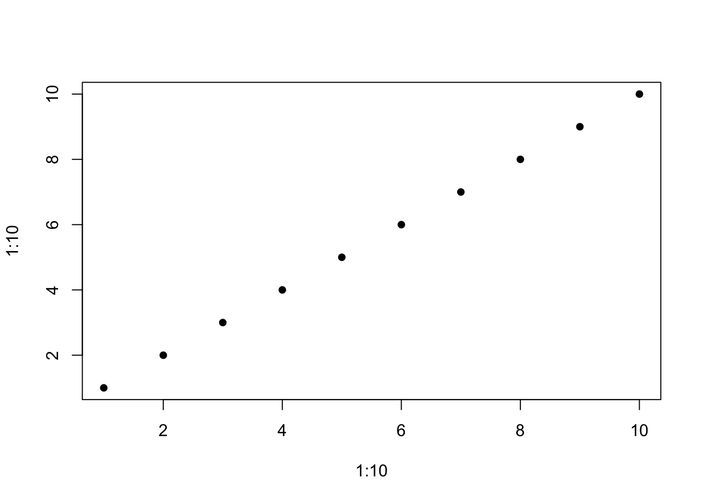

<!-- This is the format for text comments that will be ignored during renderings. Do not put R code in these comments because it will not be ignored. -->

```{r, setup, echo = FALSE}
knitr::opts_chunk$set(
  collapse = TRUE,
  warning = FALSE,
  message = FALSE,
  echo = FALSE,
  comment = "#>",
  fig.path = "../figures/"
)

 # Or use devtools::load_all('.', quiet = T) if your code is in script files, rather than as functions in the `/R` diretory
```

# Introduction

Here is a citation [@Marwick2017]

# Background

## Background Subsection
```{r demo, eval = TRUE, fig.cap="My Plot"}
x <- 1 + 1
plot(1:10, 1:10, pch = 16)
plot(rnorm(40), rnorm(40), pch = 16)
```

The result of the calculation is `r x`.

Control+Option+(Alt) + i
```{r}

```

```{r}
knitr::kable(head(iris))
```

# Methods

# Results

```{r get-data, eval = TRUE}
# Note the path that we need to use to access our data files when rendering this document
# my_data <- read.csv(here::here('analysis', 'data', 'raw_data', 'my_csv_file.csv'))
x <- x + 1
```

Test `r x` has changed or not.

# Discussion

# Conclusion

# Acknowledgements

<!-- The following line inserts a page break when the output is MS Word. For page breaks in PDF, use \newpage on its own line.  -->
##### pagebreak

# References 
<!-- The following line ensures the references appear here for the MS Word or HTML output files, rather than right at the end of the document (this will not work for PDF files):  -->
<div id="refs"></div>

##### pagebreak

### Colophon

This report was generated on `r Sys.time()` using the following computational environment and dependencies: 

```{r colophon, cache = FALSE}
# which R packages and versions?
devtools::session_info()
```

The current Git commit details are:

```{r}
# what commit is this file at? 
git2r::repository(here::here())
```
